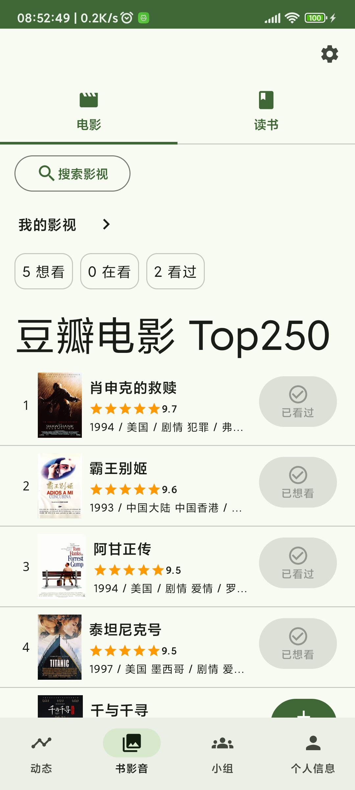
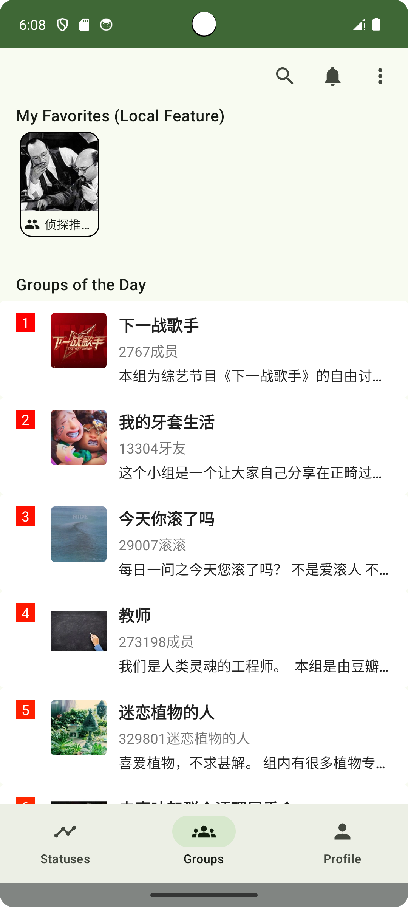
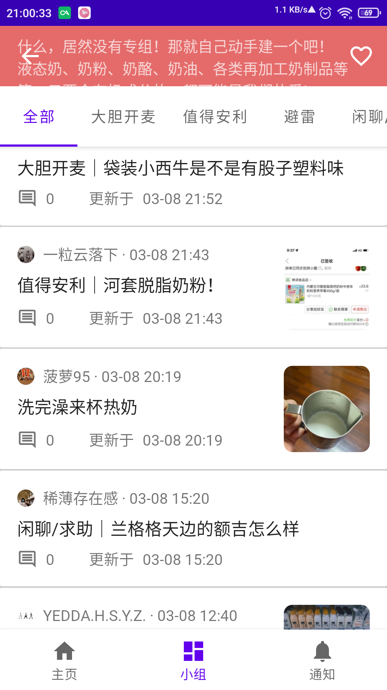

doubean
=======

An unofficial [Douban][douban] app for browsing [Groups][douban-groups] and exploring Subjects (books/movies/TVs)
\([豆瓣][douban]非官方app，支持[小组][douban-groups]浏览和书影~~音~~探索\)

**Disclaimer:** This is an experimental project focused on core features using Jetpack Compose. Expect potential crashes, incomplete UI, or missing features. 

**Known Issue:** 
- Login image captcha needs more testing.

[douban]: https://www.douban.com/
[douban-groups]: https://www.douban.com/group/

## Features

- Subjects (Books/Movies/TVs, WIP 🚧):
  - Home feed with personal statuses, subject unions, and rank lists
  - Interests
  - Subject search
  - View subject details (metadata, intro, interactions)
  - Browse rank lists
- Groups:
  - Browse my groups and topics
  - Explore group details, topics, and comments
  - Search for groups
  - Enhancements:
    - Locally favorite tabs/groups
    - Sort topics by original order or create time within any page
    - Customizable topic notifications
- General:

  - Ad-free and lightweight (~3MB)
  - Login support (beta) & session reuse (root required)
  - Partial deep linking support
  - Direct official API calls
  - Basic Material Design 3 (MD3) theming
  - Image viewer
  - Profile & login screens
  - View statuses feed (legacy)
  - Mobile-optimized pure Web screens (deprecated)

## Screenshots

 
    

## Getting Started

- Download the [Latest release][latest-release]
- Install on Android: 8.1+
- Feel free to [file issues](https://github.com/Bumblebee202111/doubean-public/issues)
  - If data fails to load, please include titles and error messages if possible.
- Keep Official App: It's recommended to keep the official Douban app installed for full functionality, to support Douban, and enable login session reuse (root).
- Troubleshooting: If you experience crashes after updates, try clearing the app data.

[latest-release]: https://github.com/Bumblebee202111/doubean-public/releases/latest

## Important Notices

### Source Code Status

Only selected source code from the private project is shared here to mitigate potential issues. More code may be synced later (WIP).

### Guidelines

- Use for personal learning.
- Avoid promoting widely without permission.

## Tech Stack

- [Foundation][foundation]: [Android KTX][android-ktx]
- [Architecture][arch]: [Lifecycles][lifecycle], [Navigation][navigation], [Paging][paging], [Room][room], DataStore, [ViewModel][viewmodel], [WorkManager][workmanager]
- [UI][ui]: Jetpack Compose
- Behavior: [Notifications][notifications]
- Third-party libraries
  - [Kotlin Coroutines][kotlin-coroutines]
  - Kotlinx Serialization
  - Ktor
  - Coil
  - libsu
  - Accompanist Permissions/WebView

[foundation]: https://developer.android.com/jetpack/components
[appcompat]: https://developer.android.com/topic/libraries/support-library/packages#v7-appcompat
[android-ktx]: https://developer.android.com/kotlin/ktx
[test]: https://developer.android.com/training/testing/
[arch]: https://developer.android.com/jetpack/arch/
[lifecycle]: https://developer.android.com/topic/libraries/architecture/lifecycle
[navigation]: https://developer.android.com/topic/libraries/architecture/navigation/
[paging]: https://developer.android.com/topic/libraries/architecture/paging/v3-overview
[room]: https://developer.android.com/topic/libraries/architecture/room
[viewmodel]: https://developer.android.com/topic/libraries/architecture/viewmodel
[workmanager]:https://developer.android.com/topic/libraries/architecture/workmanager
[ui]: https://developer.android.com/guide/topics/ui
[notifications]: https://developer.android.com/develop/ui/views/notifications
[kotlin-coroutines]: https://kotlinlang.org/docs/reference/coroutines-overview.html

## Roadmap

Upcoming features, bug fixes, libraries to use and environment changes \(roughly in chronological order\). Primarily for personal tracking.

### Current release \(0.9.0)

- Owned doulists

### Next release \(0.9.1)

- Collect subjects/topics

### 0.9.2

- UserProfile:
  - My subjects
  - My groups

### Future plans

- Groups 
  - Subscribe/favorite/collect/react
    - Collect topics
    - Remove locally group favorites (use official subscribing)
    - Pin my groups
    - Add corresponding item actions
  - Tab/tag → 分区
  - Notifications: New interval option of 1h (current: 15m)
  - Search:
    - Search topics within a specific group/tab
    - Global topic search across all groups
    - Tabbed search results
  - Dynamic topic sorting options
  - Simplify topic caching
  - Group Home: Potential pagination for recommended topics
  - Group tab: Track topic read status
  - Group Detail
    - Auto-collapse header on entry for subscribed/favorited groups/tabs
    - Fix group description action overflows
  - Topic:
    - Fully load content via official script, no manual parsing
    - Fix content scroll position restoration
    - Fix crash loading comments
  - Hide officially-flagged "unfriendly" content by default
  - Implement content blocking
  - Reddit-style item expand/collapse for lists
  - Investigate API for *all* followed topics like desktop Web app (currently seems unlikely)
    - Use as home/notifications data source
- Subjects
  - Subject Detail: Ratings histogram
  - Color schemes
  - More
- Doulists
  - Following doulists
  - Pagination

- Sync more source files to public repo
- Error messages: Show endpoint
- Persist last-active tab
- Complete deep linking support
- Expand/collapse component: Hide action for short text
- Search suggestions
- Login: Code-based (w/o pw)
- Shortcuts
- Improve display of login prompts and standard tooltips/info messages
- Restore load state visualization (removed during Compose migration)
  - Paging 3 refresh, loading status ...
- Restore dark mode & landscape support
- ImageScreen → Shared element transitions
- List item menus → Bottom dialog sheets
- Improve model layering
- i18n
  - Translations
  - Language selection
- NetworkManager
- Widgets
  - Calender today

- QR
- (Rooted users) Optionally sync more official app preferences for API request consistency
- Consider use single NavHost
- Statuses (maintenance mode)
  - Additional card types
  - Pagination

* Test

## References

- Jetpack Compose samples
- [Android Sunflower][sunflower]
- [Developer Guides][guides]
- [Github Browser Sample with Android Architecture Components][github-browser-sample]
- [Android Architecture Blueprints v1 (todo-mvvm-live)][todo-mvvm-live]
- [Material Design][material]
- Various social apps (UI/UX inspiration)

[sunflower]: https://github.com/android/sunflower
[guides]: https://developer.android.google.cn/guide
[github-browser-sample]: https://github.com/android/architecture-components-samples/tree/master/GithubBrowserSample
[todo-mvvm-live]: https://github.com/android/architecture-samples/tree/todo-mvvm-live
[material]:https://material.io/

## Utilities

- [HTTPCanary][http-canary] for analyzing API
- [jadx][jadx]-gui for understanding models
- [Google Chrome][google-chrome] for debugging CSS

[http-canary]:https://github.com/MegatronKing/HttpCanary/

[jadx]:https://github.com/skylot/jadx/releases

[google-chrome]:https://www.google.com/chrome/

## Stars :star: & Donation :coffee:

Your ⭐ **stars** motivate continued development! While not actively seeking donations, if you wish to support development, please open an issue to discuss.

## License

This project is licensed under the **MIT License**. See the [LICENSE](LICENSE) file for the full license text.
