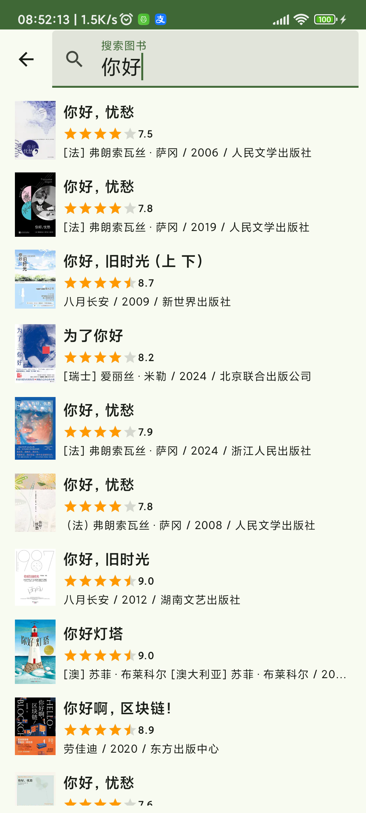

doubean
=======

An unofficial [Douban][douban] app focused on browsing [Groups][douban-groups] and exploring Subjects  (books/movies/TV). The Subjects module is under construction.
\([豆瓣][douban]非官方app，主要用于浏览[小组][douban-groups]和探索书影~~音~~，后者开发中。\)

**Note**: This personal project implements essential and user-requested features while serving as a playground for experimenting with trending technologies like Jetpack Compose. Occasional crashes, incomplete UI designs, or missing features may occur.

[douban]: https://www.douban.com/

[douban-groups]: https://www.douban.com/group/

Introduction
------------

### Screens

#### Statuses Screen

- Following statuses

#### Subjects Screens

##### Home Screen

- Top 250 Movies/Books
- My movie/TV/book statuses

##### Interests Screen

- My subject statuses with interests

##### Search Subjects Screen

- Search subjects

##### Movie/Tv/Book  Screen

- Header
- Intro
- Interests
- More

##### Rank List Screen

- Rank list

#### Groups Screens

##### Home Screen

* My groups
* Favorite groups and tabs
* My topics (or groups of the day for guests)

##### Group Detail Screen

* Group information
* Group tabs

##### Topic Detail Screen

* Topic content
* Topic comments

##### Reshare Statuses Screen

- Reshare statuses

##### Groups Search  Screen

* Search groups
* Groups of the day

##### Notifications Screen 

* Group topic notifications

#### Profile Screen

- Login status

#### Image Screen

- View/save images

**Login Screen**

- Session login
  - Guide
  - Manual input

### Screenshots

    
    

   

### Getting Started

### Using this app

- [Latest release][latest-release]
- Android: 8.1 - 14 (and virtually 15)
- Feel free to file issues
  - If data fails to display (likely due to a JSON parsing error), including:
    - Titles, related URLs (from Douban app)
    - Raw JSON (if accessible).
- It's recommended to keep the official Douban app installed
  - Support the official product
  - Access content missing in doubean
  - Especially for [rooted users](#reuse-login-session)
- Occasionally, you may need to manually clear app data after updates if I forget to handle ROOM database migrations properly.

[latest-release]: https://github.com/Bumblebee202111/doubean-public/releases/latest

### Limited Open-Source

To avoid potential issues, public repo retains an outdated codebase. Non-sensitive code may be shared upon request.

### Guidelines

- **Do:** Use for personal learning.
- **Don’t:** Promote elsewhere without permission.

### Features

* Provides a simple type-based Subjects experience with support for user actions (WIP 🚧)
* Groups. Custom features:
  * Favorite tabs/groups locally
  * Custom topic sorts-by of create time by sorting each page of original data
  * Customizable topic notifications
* Ad-free and lightweight: ~4MB
* Rooted users can reuse login sessions from Douban app (phone login not supported)
* Partial support for URL deep links
* Very basic Statuses tab (no longer updated)
* Partial support for viewing content in a mobile-optimized Douban WebView (no longer updated).
* Basic use of MD 2/3 (migration on going)

## Tech Stack

* [Foundation][foundation]: [AppCompat][appcompat], [Android KTX][android-ktx]
* [Architecture][arch]: [Lifecycles][lifecycle], [Navigation][navigation], [Paging][paging], [Room][room], DataStore, [ViewModel][viewmodel], [WorkManager][workmanager]
* [UI][ui]: [Animations & Transitions][animation], Jetpack Compose, [Fragment][fragment], [Layout][layout]
* Behavior: [Notifications][notifications]
* Third party libraries
  * [Kotlin Coroutines][kotlin-coroutines]
  * Kotlinx Serialization
  * Ktor
  * Coil
  * libsu

[foundation]: https://developer.android.com/jetpack/components

[appcompat]: https://developer.android.com/topic/libraries/support-library/packages#v7-appcompat

[android-ktx]: https://developer.android.com/kotlin/ktx

[test]: https://developer.android.com/training/testing/

[arch]: https://developer.android.com/jetpack/arch/

[lifecycle]: https://developer.android.com/topic/libraries/architecture/lifecycle

[navigation]: https://developer.android.com/topic/libraries/architecture/navigation/

[paging]: https://developer.android.com/topic/libraries/architecture/paging/v3-overview

[room]: https://developer.android.com/topic/libraries/architecture/room

[viewmodel]: https://developer.android.com/topic/libraries/architecture/viewmodel

[workmanager]:https://developer.android.com/topic/libraries/architecture/workmanager

[ui]: https://developer.android.com/guide/topics/ui

[animation]: https://developer.android.com/training/animation/

[fragment]: https://developer.android.com/guide/components/fragments

[layout]: https://developer.android.com/guide/topics/ui/declaring-layout

[notifications]: https://developer.android.com/develop/ui/views/notifications

[kotlin-coroutines]: https://kotlinlang.org/docs/reference/coroutines-overview.html

### Plans

Incoming features, bug fixes, libraries to use and environment changes \(roughly in chronological order\). Primarily for myself.

#### Current release \(0.7.15\)

#### Next release \(0.7.16)

#### Future plans

* Allow non rooted users (guests) to browse their subjects/groups if a user ID is provided

* Subjects

  * (Single-)status interests screen & its pagination
  * Tweak reviews sheet for better arrangement of review counts
  * More details & sub-features
  
* Remember last active bottom navigation/Subjects tabs

* Replace Material Icons’ "Thumb Up" icon

* Groups
  * Dynamic topic sorts-by

  - Re-evaluate ROOM caching (complexity reduction)
  - Tweak component colors for group-themed screens

  * Home
    * Maybe support pagination of recommended topics
  * Subscribe/favorite/save
    * Save topics
    * Pin my groups
    * Add corresponding item actions
  * Group tab: Track topic read status
  * Search
    * Search topics within a specific group/tab
    * Global topic search across all groups
  * Use the new nullable "edit_time" property of network topics
  * Revert naming conventions to match Douban's standards
  * Group Detail

    * Collapse on entrance for the subscribed/favorited group/tab
    * Fix group description action overflows
  * Hide officially-flagged unfriendly content by default
  * Support blocking unwanted content
  * Lists: Reddit-style item expand/collapse
  * Find API for all followed topics (currently unlikely)
  
* Expand/collapse component: Hide action for short text

* Shortcuts

* Properly show login prompts & normal tips/info

* Error handling

  * Process error body
  * Show error messages

* Load state visualization (removed during migrations for simplicity)
  * Paging 3 refresh, loading status ...

* Restore dark mode & landscape support

* Migrate `WebView`, `RatingBar`, and `PreferenceFragmentCompat` to Jetpack Compose/MD3.

* Shared element

* Display menu dialog sheets instead for list items

* Improve model layering

* Languages
  * Translations
  * Pick language

* NetworkManager

* Widgets

* Optionally sync more preferences from the official Douban app for API request consistency for rooted users

* Consider use single NavHost

* Independent login (currently unlikely)

* Statuses (maintenance mode)
  * Additional card types
  * Pagination

* Test

### Non-Todos

* Heavy use of Material Design

### References

* Jetpack Compose samples
* [Android Sunflower][sunflower]
* [Developer Guides][guides]
* [Github Browser Sample with Android Architecture Components][github-browser-sample]
* [Android Architecture Blueprints v1 (todo-mvvm-live)][todo-mvvm-live]
* [Material Design][material]
* Various social apps: used as references for UI design and functionality

[sunflower]: https://github.com/android/sunflower

[guides]: https://developer.android.google.cn/guide

[github-browser-sample]: https://github.com/android/architecture-components-samples/tree/master/GithubBrowserSample

[todo-mvvm-live]: https://github.com/android/architecture-samples/tree/todo-mvvm-live

[material]:https://material.io/

### Utilities

* [HTTPCanary][http-canary] for analyzing Douban API requests
* [jadx][jadx]-gui for understanding models
* [Google Chrome][google-chrome] for debugging CSS

[http-canary]:https://github.com/MegatronKing/HttpCanary/

[jadx]:https://github.com/skylot/jadx/releases

[google-chrome]:https://www.google.com/chrome/

### Stars :star: & Donation :coffee:

I know this app isn’t perfect, but the growing number of stars keeps me motivated. Thank you for your support!

If you find the app useful and want to buy me a coffee (though I’m not actively seeking donations), contact me by via issues.

