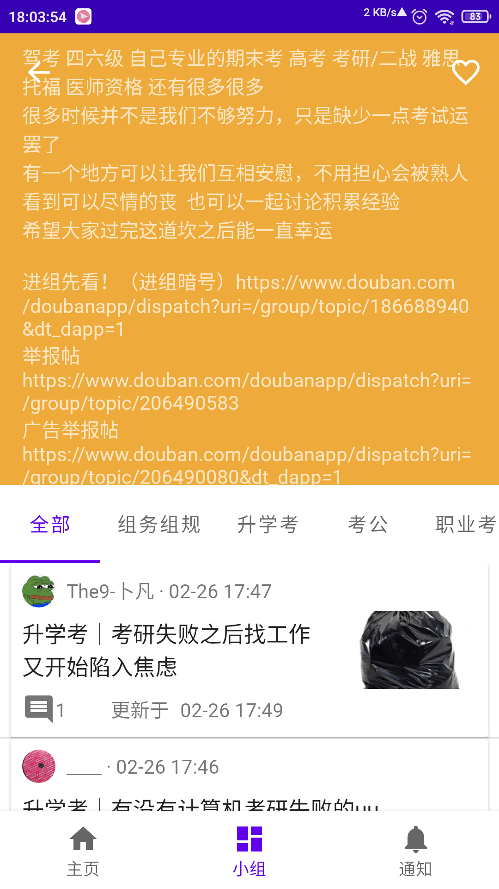

doubean
=======

豆瓣非官方app，主要用于小组浏览。**练手项目，仍未初步完成**。

注意
----

* 即日起随缘更新。
* 试着上传app-release.apk。
  * DoubanService已加入.gitignore，担心侵权，但根本没人看，犹豫中……
* 编写代码时抄袭了大量Android官方样例，原创性极低，但代码质量自觉不高，请谨慎参考。
* 所有列表最多加载100个元素，如需查看完整列表，请点击在豆瓣网页中查看（实现中，现仅话题详情支持）

App受众
-------

* 作为小白学习Android开发、Java编程以及Git和Github的使用中的本人
* 本人和其他有轻度使用需求的用户
* 其他感兴趣的开发者

## 功能

该app包含三个主界面

### GroupFragment

#### 小组主界面

* 收藏小组和标签

#### 小组详情

* 小组简介
* 小组话题

#### 小组话题详情

* 话题内容
* 话题评论

#### 小组搜索

* 搜索小组

### HomeFragment

空，来自模板，placeholder

### NotificationFragment

同上

计划
----

功能、关键的库、bug修复

* **待实现（较为现实的计划，既包含细枝末节，也包含整体要求）**
  * 适当补充尚未使用的字段，如显示评论中的图片、在评论中标注楼主、显示回复的评论
  * 保存WebView中的图片
  * SwipeRefreshLayout（试试看）
  * 分享功能
  * 添加记录已读、取消已读的功能
  * 设计Tab工具栏？搜索话题？Tab的收藏按钮移动至自己的工具栏？
  * 直接在收藏列表中移除收藏、调整顺序
  * 🛠从话题页返回话题列表时TabLayout回到原位置
  * 🛠部分接口的缺失字段覆盖已有字段导致模型丢失缓存（拖，临时解决方案：不保存不完整的对象）
  * 🛠Room离线时不加载（拖，应该容易排除）
  * 能建立自定义话题类别，根据多个小组、话题标签（tag aka tab）订阅话题，支持关键词过滤（有难度，但不一定有用）
  * 继续完善WebView的Fragment
  * 优化UI，调整View间的布局，设置主题
  * ……
* 看未来（画饼）
  * Paging （重中之重，基本需求）
  * Widgets
  * 通知、推送（考虑其意义、国情和作者自身条件，搁置）
  * 🛠MIUI 10 Android 8.1加载含WebView的NestedScrollView时子视图会因滑动或WebView中选中本文等操作而消失或
    复现（原因未知，初步判断为旧版MIUI的问题，由于本人水平有限且系统较旧，暂时搁置）
  * 豆瓣除小组外其他模块（如图书）
* 不考虑
  * 基于登录的服务
  * Kotlin
  * Dagger2/Hilt
  * RxAndroid

特点
----

* 基于100% Java语言，尽自己所能选用权威的库（Jetpack中的库和优秀第三方库）、架构（MVVM）和理念（Android Jetpack）
  * 同时对Hilt/Dagger2/Kotlin/WorkManager等新技术和争议技术持保守的观望态度
  * 保证了较好的性能，便于代码编写和阅读，在一定程度上弥补了作者自身水平的不足
* 支持在豆瓣网页的WebView中查看Fragment，用作显示完整信息以及预防接口失效，注入了JavaScript以禁用多余元素和正确缩放
* 对UI的字符串常量提供中英双语支持
* 能够使用某种方式获取豆瓣实时数据
* 使用ROOM作为豆瓣服务器数据的缓存
* 根据多条件订阅关注的话题（画饼）
* 轻量app（既由于作者水平和精力有限，又由于官方app诸多“累赘”的模块和功能不在本项目开发计划之内）
* 较为原始的依赖注入：InjectorUtils.java
* 访问接口采用了Apache Commons的现成工具，极大地简化代码。
* 支持豆瓣网页URL的deep links

使用的库
-------

* [Foundation][foundation]
  * [AppCompat][appcompat]
  * [Test][test]（待使用）
* [Architecture][arch]
  * [Data Binding][data-binding]
  * [Lifecycles][lifecycle]
  * [LiveData][livedata]
  * [Navigation][navigation]
  * [Room][room]
  * [ViewModel][viewmodel]
* [UI][ui]
  * [Animations & Transitions][animation]
  * [Fragment][fragment]
  * [Layout][layout]
* Third party and miscellaneous libraries
  * Retrofit
  * Apache Commons
  * [Glide][glide]

[foundation]: https://developer.android.com/jetpack/components

[appcompat]: https://developer.android.com/topic/libraries/support-library/packages#v7-appcompat

[test]: https://developer.android.com/training/testing/

[arch]: https://developer.android.com/jetpack/arch/

[data-binding]: https://developer.android.com/topic/libraries/data-binding/

[lifecycle]: https://developer.android.com/topic/libraries/architecture/lifecycle

[livedata]: https://developer.android.com/topic/libraries/architecture/livedata

[navigation]: https://developer.android.com/topic/libraries/architecture/navigation/

[room]: https://developer.android.com/topic/libraries/architecture/room

[viewmodel]: https://developer.android.com/topic/libraries/architecture/viewmodel

[ui]: https://developer.android.com/guide/topics/ui

[animation]: https://developer.android.com/training/animation/

[fragment]: https://developer.android.com/guide/components/fragments

[layout]: https://developer.android.com/guide/topics/ui/declaring-layout

[glide]: https://bumptech.github.io/glide/

参考的资料
---------

* [Android Sunflower][sunflower]
* [Developer Guides][guides]
* [Github Browser Sample with Android Architecture Components][github-browser-sample]
* [Android Architecture Blueprints v1 (todo-mvvm-live)][todo-mvvm-live]
* 他人博客和仓库中有关获取豆瓣数据的方法
* StackOverflow
* Google

[sunflower]: https://github.com/android/sunflower

[guides]: https://developer.android.google.cn/guide

[github-browser-sample]: https://github.com/android/architecture-components-samples/tree/master/GithubBrowserSample

[todo-mvvm-live]: https://github.com/android/architecture-samples/tree/todo-mvvm-live

辅助工具
---------

* HTTPCanary
* MiX
* jadx-gui
* Google Chrome for CSS debugging
