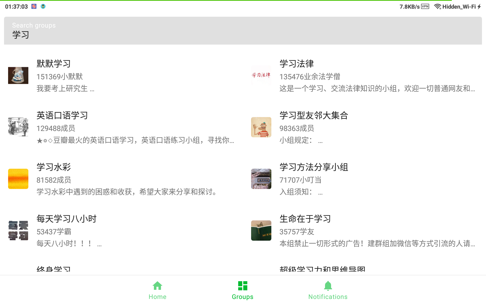

doubean
=======

An unofficial [Douban][douban] app mainly used for browsing the [Groups][douban-groups] section.
\([豆瓣][douban]非官方app，主要用于[小组][douban-groups]浏览。\)

The development of this app is resumed to meet the requests of the friend who filed the first issue! While we will only add new features for the limited number of existing users, this project is also going to be used as my playground for fashionable libraries/coding styles such as Jetpack Compose. This brings [tons of migration tasks](#migrations), and also means that old libraries and new libraries are currently mixed together.

Note I am an inexperienced Android beginner and the only developer of it. Occasional crashes may happen, UI design may be incomplete and features you need may be missing.

It has been inactive for 8 months, as:
* Reinforced by the org/mods, hilarious remarks can be found everywhere
* There are few other alternatives for me to refer to
* Group theming was a mess

**Very important changes starting from 0.5.0:**

* Repo name: `doubean` -> `doubean-public`
  - New code will only be pushed into the private `doubean`
* New package name: com.github.bumblebee202111.doubean

[douban]: https://www.douban.com/

[douban-groups]: https://www.douban.com/group/

Introduction
------------

### Functionality

The app is composed of 4 main screens

#### HomeFragment (new)

- Following

#### ImageFragment (new)

- Image view and save

#### GroupFragment

##### Groups Home

* Favorite groups and tabs

##### Group Detail

* Group information
* Group tabs

##### Post Detail

* Post content
* Post comments

#### ProfileFragment (raw)

- Login status

##### Groups Search

* Search groups

#### NotificationFragment

* Group post notifications (the feature is broken now)

### Screenshots

### Getting Started

### Using this app

- Supported Android versions: 8.1 - 14
- Sometimes you need to manually clear app data when I forget to handle ROOM database schema change
- Feel free to file issues 

### Open-source?

To not get this project/myself into trouble, the update of the source code in the public repo will be suspended. However, the latest release is always available.

### Who is it for?

* Me and other developers who are learning Android, Kotlin and version control
* Me and other users who want easier access to Douban groups module

### Your do's and don'ts

- Please use it only for personal learning purposes. 
- Please don't share it on other websites/apps without permission.

### Features

It not only implements the very basic features of Douban app, but also has its own features. 

| Design Aspect     | Choice\(s\)                                     |
|-------------------|-------------------------------------------------|
| Language          | Kotlin                                          |
| Libraries         | Jetpack and authoritative third party libraries |
| Architecture      | MVVM                                            |
| Design philosophy | Android Jetpack                                 |

* Partial offline caching support
* Ad-free, lite \(~4MB\)
* Partially support URL deep links
* Rooted users can use login session of Douban app
* Partial support for viewing content in Douban WebView optimized for mobile reading in case of need
* Basic use of MD2/3 (may not get along well during migration)
* Recommended post notifications (maybe currently broken)

Libraries Used
--------------

* [Foundation][foundation]
  * [AppCompat][appcompat]
  * [Android KTX][android-ktx]
  * [Test][test] \(TODO\)
* [Architecture][arch]
  * [Data Binding][data-binding]
  * [Lifecycles][lifecycle]
  * [Navigation][navigation]
  * [Paging][paging]
  * [Room][room]
  * DataStore
  * [ViewModel][viewmodel]
  * [WorkManager][workmanager]
* [UI][ui]
  * [Animations & Transitions][animation]
  * [Fragment][fragment]
  * [Layout][layout]
  * Jetpack Compose
* Behavior
  * [Notifications][notifications]
* Third party and miscellaneous libraries
  * Ktor
  * Coil
  * [Kotlin Coroutines][kotlin-coroutines]
  * Flow
  * Kotlinx Serialization
  * libsu

[foundation]: https://developer.android.com/jetpack/components

[appcompat]: https://developer.android.com/topic/libraries/support-library/packages#v7-appcompat

[android-ktx]: https://developer.android.com/kotlin/ktx

[test]: https://developer.android.com/training/testing/

[arch]: https://developer.android.com/jetpack/arch/

[data-binding]: https://developer.android.com/topic/libraries/data-binding/

[lifecycle]: https://developer.android.com/topic/libraries/architecture/lifecycle

[navigation]: https://developer.android.com/topic/libraries/architecture/navigation/

[paging]: https://developer.android.com/topic/libraries/architecture/paging/v3-overview

[room]: https://developer.android.com/topic/libraries/architecture/room

[viewmodel]: https://developer.android.com/topic/libraries/architecture/viewmodel

[workmanager]:https://developer.android.com/topic/libraries/architecture/workmanager

[ui]: https://developer.android.com/guide/topics/ui

[animation]: https://developer.android.com/training/animation/

[fragment]: https://developer.android.com/guide/components/fragments

[layout]: https://developer.android.com/guide/topics/ui/declaring-layout

[notifications]: https://developer.android.com/develop/ui/views/notifications

[kotlin-coroutines]: https://kotlinlang.org/docs/reference/coroutines-overview.html

### Plans

Incoming features, bug fixes, libraries to use and environment changes \(roughly in chronological order\)

#### To-dos for current release \(0.5.10\)

#### To-dos for next release \(0.5.11)

#### Future plans

* Date & time: `Yesterday hh:mm`
* Gradually revert naming conventions to those of Douban
* Gracefully remove Fragments: Reduce uses of Fragment methods
* Gradual migrations: 
  * From MD2 / custom design to MD3
  * From View and data binding to Jetpack Compose
    * Exceptions: WebView
  * From Navigation Fragment to Navigation Compose (take action when next stable version is available)
    * From NavHostFragment to ComposableNavHostFragment
* navigation-fragment-compose
* GroupsHome: Support pagination? & add favorite tabs for topic list area
* Home - Following
  * More card types
  * Pagination
* Group notifications
  * Group Tab: Untighten tab notification settings from group model
* TopAppBar and Edge-to-Edge
  * Reduce MD3 TopAppBar height to 56 dp when https://developer.android.google.cn/jetpack/androidx/releases/compose-material3#1.3.0-alpha06 enters RC
* Bring back load state visualization which was removed during various types of migrations
  * Paging 3 refresh, loading status ...
* Follow/favorite/save/subscribe
  * Local favorites needs some kind of rework since following groups (official feature) is possible now although not implemented
  * Save topics
  * Follow groups
  * Pin followed groups
  * Add corresponding item actions
* Group Detail: Collapse on entrance for the followed group/tab
* Allow expanding group description w/ SpannableString
* Bring back basic support for dark mode & landscape experience
* Topics sort by 
  * "Last updated" -> "active"
  * Add "New Top"
* Shared element
* Lazylist problems
  * Restoration of scroll position is problematic
  * Topic content WebView problems
    * Flinging up to topic content is not smooth https://issuetracker.google.com/issues/172029355
    * Sometimes topic content fails to be loaded on some low-end or large-screened devices (not sure which sets constraint)
    * LazyLayoutPinnableItem?
    * ...
* Group tab: Track read
* Fix broken topics feed
  * Find why fail
  * “每次动态更新请求的帖子总数限制” -> frequency (0..1) 
* Use the new nullable "edit_time" property of network posts
* Search
  * Search group/tab posts (in-group) 
  * Search posts of all groups (global)
* Better model layering
* Distinguish`en-DB`/`en-US`
* More follow/favorite/save/subscribe
  * Save comments
  * Subscribe topics
  * Sync custom lists by maintaining a fake private note (日记) which holds the data
  * Custom feeds like Reddit
* Group Detail: Group/tab/post shortcuts
* Hide officially-marked unfriendly content by default
* Support blocking unfriendly content
* NetworkManager
* Widgets
* \[Books\] Add T250
* \[Movies\] Add T250
* More features of books & movies
* Group Detail: For post items, optimize tag display, e.g., assign color to each tag mapped from name
* Lists: Reddit-like item expand/collapse
* Real login (seems impossible)
* Find API for all followed topics (seems impossible)
* Group Detail: WebView for group
* Test

### Non-Todos

* Heavy use of Material Design

### References

* New Compose samples
* [Android Sunflower][sunflower]
* [Developer Guides][guides]
* [Github Browser Sample with Android Architecture Components][github-browser-sample]
* [Android Architecture Blueprints v1 (todo-mvvm-live)][todo-mvvm-live]
* [Material Design][material]
* Interactive communities: [StackOverflow][stack-overflow], [Google][google], [GitHub][github]
  , [cnblogs][cnblogs], [Medium][medium], [CSDN][CSDN], IssueTracker, etc.
  * Especially went through articles/posts on how to gain Douban access
* Various social apps as references for UI design

[sunflower]: https://github.com/android/sunflower

[guides]: https://developer.android.google.cn/guide

[github-browser-sample]: https://github.com/android/architecture-components-samples/tree/master/GithubBrowserSample

[todo-mvvm-live]: https://github.com/android/architecture-samples/tree/todo-mvvm-live

[material]:https://material.io/

[stack-overflow]: https://stackoverflow.com/

[google]: https://www.google.com/

[cnblogs]: https://www.cnblogs.com/

[github]:https://github.com/

[medium]:https://medium.com/

[csdn]: https://blog.csdn.net/

### Utilities

* [HTTPCanary][http-canary] for douban access
* [jadx][jadx]-gui for understanding models
* [Google Chrome][google-chrome] for CSS debugging

[http-canary]:https://github.com/MegatronKing/HttpCanary/

[jadx]:https://github.com/skylot/jadx/releases

[google-chrome]:https://www.google.com/chrome/

