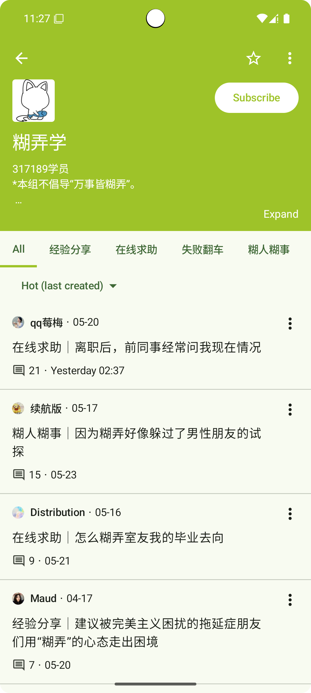
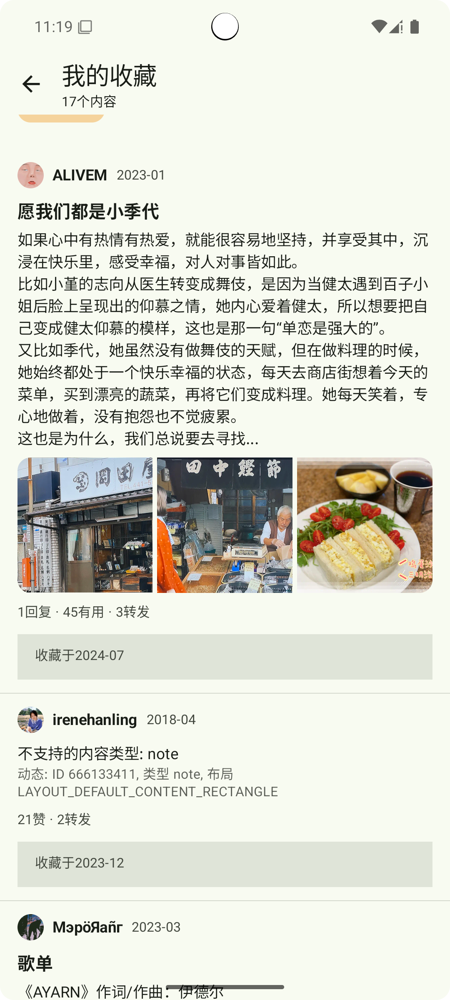

doubean
=======

An unofficial [Douban][douban] app for browsing [Groups][douban-groups] and exploring Subjects (books/movies/TVs)
\([豆瓣][douban]非官方app，支持[小组][douban-groups]浏览和书影探索\)

**Disclaimer:** This is an experimental project focused on core features using Jetpack Compose. Expect potential crashes, incomplete UI, or missing features. 

**Known Issue:** 
- Login image captcha requires further testing.
  - [**Need your feedback when triggered**](https://github.com/Bumblebee202111/doubean-public/issues/11)

[douban]: https://www.douban.com/
[douban-groups]: https://www.douban.com/group/

## Features

- Subjects (Books/Movies/TVs):
  - Home feed with personal statuses, subject unions, rank lists
  - Interests
  - Subject search
  - View subject details (metadata, intro, interactions)
  - Rank list browsing
- Groups:
  - Browse my groups and topics
  - Explore group details, topics, and comments
  - Group search
  - Enhancements:
    - Local favorites for tabs/groups
    - Sort topics by original order or create time within any page
    - Customizable topic notifications
- Doulists (WIP 🚧):
  - Topic, subject, and review items supported
  - Collect topics/subjects
  - My Doulists: Collected items + doulists
- General:

  - Ad-free and lightweight (~3MB)
  - Login support (beta) & session reuse (root required)
  - Partial deep linking
  - Direct official API calls
  - Basic Material Design 3 (MD3) theming
  - Basic image viewer
  - User profile screen
  - View statuses feed (legacy)
  - Mobile-optimized pure Web screens (legacy)

## Screenshots

 

 

## Getting Started

- Download the [Latest release][latest-release]
- Install on Android: 8.1+
- Feel free to [file issues](https://github.com/Bumblebee202111/doubean-public/issues)
- Keep official app: Recommended to have the official Douban app installed for full platform functionality.
- Troubleshooting: If crashes occur after updates, try clearing app data.

[latest-release]: https://github.com/Bumblebee202111/doubean-public/releases/latest

## Important Notices

### Source Code Status

Only selected source code from a private project is shared here to mitigate potential issues. More may be synced later (WIP).

### Guidelines

- For personal learning & exploration.
- Please avoid wide promotion.

## Tech Stack

- [Foundation][foundation]: [Android KTX][android-ktx]
- [Architecture][arch]: [Lifecycles][lifecycle], [Navigation][navigation], [Paging][paging], [Room][room], DataStore, [ViewModel][viewmodel], [WorkManager][workmanager]
- [UI][ui]: Jetpack Compose
- Behavior: [Notifications][notifications]
- Third-party libraries
  - [Kotlin Coroutines][kotlin-coroutines], Kotlinx Serialization, Ktor, Coil, libsu, Accompanist Permissions/WebView

[foundation]: https://developer.android.com/jetpack/components
[appcompat]: https://developer.android.com/topic/libraries/support-library/packages#v7-appcompat
[android-ktx]: https://developer.android.com/kotlin/ktx
[test]: https://developer.android.com/training/testing/
[arch]: https://developer.android.com/jetpack/arch/
[lifecycle]: https://developer.android.com/topic/libraries/architecture/lifecycle
[navigation]: https://developer.android.com/topic/libraries/architecture/navigation/
[paging]: https://developer.android.com/topic/libraries/architecture/paging/v3-overview
[room]: https://developer.android.com/topic/libraries/architecture/room
[viewmodel]: https://developer.android.com/topic/libraries/architecture/viewmodel
[workmanager]:https://developer.android.com/topic/libraries/architecture/workmanager
[ui]: https://developer.android.com/guide/topics/ui
[notifications]: https://developer.android.com/develop/ui/views/notifications
[kotlin-coroutines]: https://kotlinlang.org/docs/reference/coroutines-overview.html

## Roadmap

Upcoming features, bug fixes, libraries to use and environment changes \(roughly in chronological order\). Primarily for personal tracking.

### Current release \(0.9.5)

### Next release \(0.9.6)

Future plans (Click to expand)

- Groups 
  - Interactions
    - Remove local group favorites when login is stable (use official subscribing)
    - Pin my groups
    - Official app-style list item actions
  - Simplify topic caching
  - Search:
    - Topics within a group/tab
    - Global topic search
    - Tabbed search results
  - Notifications: Add 1h interval option (current: 15m)
  - Home: Potential pagination for recommended topics
  - Tab
    - Track topic read status
    - Dynamic topic sorting options
  - Group Detail
    - Auto-collapse header for subscribed/favorited groups/tabs
    - Fix description action overflows
  - Topic:
    - Fully load content via official script (no manual parsing)
    - Fix content scroll restoration
  - Default hide officially-flagged "unfriendly" content
  - Implement content blocking
  - Reddit-style list item expand/collapse
  - Investigate API for *all* followed topics like desktop Web app (currently seems unlikely)
    - Use as home/notifications data source
- Subjects
  - Subject Detail: Ratings histogram
  - Color schemes
  - More
- UserProfile: My subjects, My groups
- Doulists
  - Edit/remove posts
  - Follow Doulists
  - List/post pagination
- Sync more source to public repo
- Error messages: Show endpoint
- Persist last-active tab
- Full deep linking support
- Expand/collapse component: Hide action for short text
- Search suggestions
- Login: Code-based (w/o pw)
- Shortcuts
- Improve login prompts & tooltips
- Restore load state visualization (removed during Compose migration)
  - Paging 3 refresh, loading status ...
- Restore dark mode & landscape support
- ImageScreen → Shared element transitions
- List item menus → Bottom dialog sheets
- Improve model layering
- i18n
  - Translations
  - Language selection
- NetworkManager
- Widgets: Calender today
- QR
- (Rooted users) Optional sync of more official app preferences for API request consistency
- Consider use single NavHost
- Statuses (maintenance mode)
  - Additional card types
  - Pagination
- Test

## References

- Official and unofficial sample apps
- [Developer Guides][guides]
- [Material Design][material]
- Various social apps (UI/UX inspiration)

[guides]: https://developer.android.google.cn/guide
[material]:https://material.io/

## Utilities

- [HTTPCanary][http-canary] for analyzing API
- [jadx][jadx]-gui for model understanding
- [Google Chrome][google-chrome] for debugging CSS

[http-canary]:https://github.com/MegatronKing/HttpCanary/

[jadx]:https://github.com/skylot/jadx/releases

[google-chrome]:https://www.google.com/chrome/

## Stars :star: & Donation :coffee:

Your ⭐ **stars** motivate continued development! If you find this project helpful and wish to support its development, you can treat me to a coffee via WeChat Pay: 

   
 

Thank you for your support!

## License

This project is licensed under the **MIT License**. See the [LICENSE](LICENSE) file for the full license text.
