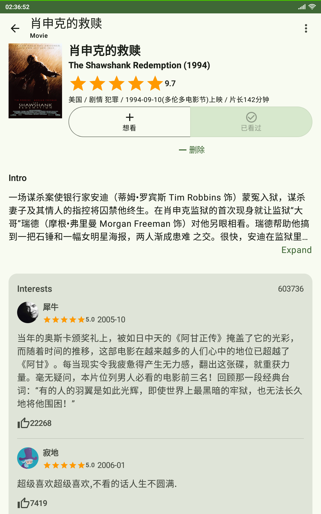
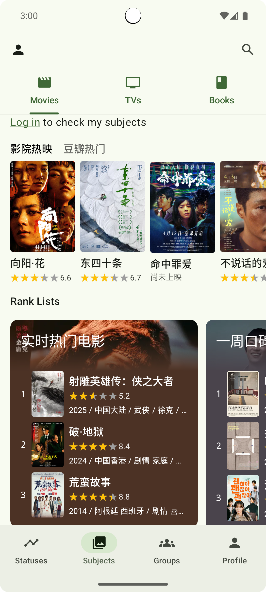

doubean
=======

An unofficial [Douban][douban] app mainly used for browsing the [Groups][douban-groups] section. Subjects development is just started.
\([豆瓣][douban]非官方app，主要用于[小组][douban-groups]浏览。书影~~音~~开发才刚刚开始。\)

Note: This personal project implements some essential features as well as user requested ones which are practical. It is also going to be used as my playground for trending technologies such as Jetpack Compose. Occasional crashes may happen, UI design may be incomplete and features you need may be missing.

**Known issues:**

- The last vertical scroll position of selected tab in Group Detail Screen is always lost (reset) when returned from Topic Detail Screen, since Navigation Compose migration, v0.6.3(603).

[douban]: https://www.douban.com/

[douban-groups]: https://www.douban.com/group/

Introduction
------------

### Screens

#### Statuses Screen

- Following statuses

#### Subjects Screens

##### Home Screen

- Top 250 Movies/Books
- My movie/tv/book statuses

##### Interests Screen

- My subject statuses with interests

##### Search Subjects Screen

- Search subjects

##### Movie/Tv/Book  Screen

- Header
- Intro
- Interests
- More

#### Groups Screens

##### Home Screen

* My groups
* Favorite groups and tabs
* My topics (or groups of the day, for guests)

##### Group Detail Screen

* Group information
* Group tabs

##### Topic Detail Screen

* Topic content
* Topic comments

##### Reshare Statuses Screen

- Reshare statuses

##### Groups Search  Screen

* Search groups
* Groups of the day

##### Notifications Screen 

* Group topic notifications (this feature is broken now)

#### Profile Screen

- Login status

#### Image Screen

- Image view and save

**Login Screen**

- Session login
  - Guide
  - Manual submission

### Screenshots

    
    

   

### Getting Started

### Using this app

- [Latest release][latest-elease]
- Supported Android versions: 8.1 - 14 (and also 15, virtually)
- Feel free to file issues
  - Specifically, if some data doesn't show, a JSON parsing error probably occurs. Including the raw JSON response (if possible) or related urls of the resource gained from the Douban app might help solve it
- It's recommended to let the Douban app coexist
  - Please support the official product
  - Lots of content is missing in doubean
  - Especially for [rooted users](#reuse-login-session)
- Sometimes you need to manually clear app data after installation when I forget to handle ROOM database schema change 

[latest-elease]: https://github.com/Bumblebee202111/doubean-public/releases/latest

### Ain't it Open-source?

To not get this project/myself into trouble, the push of the source code into the public repo has been suspended. However, if you are interested in some insensitive code, I may consider sharing it.

### Your do's and don'ts

- Please use it only for personal learning purposes. 
- Please don't share it on other websites/apps without permission.

### Features

* Provides simple type-based Subjects (书影~~音~~) experience including support of user actions (WIP 🚧)
  * Inspired by 豆瓣评分 mini program on which parts to omit
* Groups
  * Favorite tabs/groups locally

* Ad-free, lite \(~4MB\)
*  While phone login is blocked by complicated and tight authentication, rooted users can reuse login session of Douban app 
* Partially support URL deep links
* Partial offline caching support in Groups
* Very basic Statuses tab (no longer updated)
* Partial support for viewing content in Douban WebView optimized for mobile reading in case of need (no longer updated)
* Basic use of MD2/3 (UI may not look good during migration)
* ~~Recommended topic notifications (broken & disabled)~~

Libraries Used
--------------

* [Foundation][foundation]
  * [AppCompat][appcompat]
  * [Android KTX][android-ktx]
* [Architecture][arch]
  * [Lifecycles][lifecycle]
  * [Navigation][navigation]
  * [Paging][paging]
  * [Room][room]
  * DataStore
  * [ViewModel][viewmodel]
  * [WorkManager][workmanager]
  * [Data Binding][data-binding]
* [UI][ui]
  * [Animations & Transitions][animation]
  * Jetpack Compose
  * [Fragment][fragment]
  * [Layout][layout]
* Behavior
  * [Notifications][notifications]
* Third party and miscellaneous libraries
  * [Kotlin Coroutines][kotlin-coroutines]
  * Kotlinx Serialization
  * Ktor
  * Coil
  * libsu

[foundation]: https://developer.android.com/jetpack/components

[appcompat]: https://developer.android.com/topic/libraries/support-library/packages#v7-appcompat

[android-ktx]: https://developer.android.com/kotlin/ktx

[test]: https://developer.android.com/training/testing/

[arch]: https://developer.android.com/jetpack/arch/

[data-binding]: https://developer.android.com/topic/libraries/data-binding/

[lifecycle]: https://developer.android.com/topic/libraries/architecture/lifecycle

[navigation]: https://developer.android.com/topic/libraries/architecture/navigation/

[paging]: https://developer.android.com/topic/libraries/architecture/paging/v3-overview

[room]: https://developer.android.com/topic/libraries/architecture/room

[viewmodel]: https://developer.android.com/topic/libraries/architecture/viewmodel

[workmanager]:https://developer.android.com/topic/libraries/architecture/workmanager

[ui]: https://developer.android.com/guide/topics/ui

[animation]: https://developer.android.com/training/animation/

[fragment]: https://developer.android.com/guide/components/fragments

[layout]: https://developer.android.com/guide/topics/ui/declaring-layout

[notifications]: https://developer.android.com/develop/ui/views/notifications

[kotlin-coroutines]: https://kotlinlang.org/docs/reference/coroutines-overview.html

### Plans

Incoming features, bug fixes, libraries to use and environment changes \(roughly in chronological order\)

#### To-dos for current release \(0.7.9\)

* Show null rating text
* Cover corner radius
* Show rank list*s* in MoviesScreen/BooksScreen instead of T250
  * Add TVs tab then

#### To-dos for next release \(0.7.10)

#### Future plans

* Gradual migrations:
  * From MD2 / custom design to MD3
  * From View and Data Binding to Jetpack Compose
    * Exceptions: WebView/RatingBar/PreferenceFragmentCompat/CollapsingToolbarLayout/Spinner
  * Gracefully remove Fragments: First reduce usages of Fragment methods

* Subjects

  * RankListScreen & its pagination

  * (Single-)status interests screen & its pagination
  * Interest buttons
    * Maybe choose tonal style instead
  * Tweak reviews sheet
  * More details & sub-features

* Groups
  * Reuse item logic of search result groups / groups of the day
  * Fix the issue of losing last positions after researching on the Subjects tab, a simpler case of TabRow + HorizontalPager + LazyList + Pagination + Navigation Compose
  * Home
    * Support pagination?
    * Add favorite tabs for topic list area
  * Subscribe/favorite/save
    * Save topics
    * Pin my groups
    * Add corresponding item actions
  * Allow expanding group descriptions
  * Group tab: Track read
  * Search
    * Search group/tab topics (in-group) 
    * Search topics of all groups (global)
  * Use the new nullable "edit_time" property of network topics
  * Gradually revert naming conventions to those of Douban
  * Group Detail
    * Compose collapsing toolbar when API is more convenient to use
    * Collapse on entrance for the subscribed/favorited group/tab
  * Topics feed notifications
    * Find why it is broken and fix it
    * Clarify:
      * Improper use may disturb you and drain phone battery (untested)
      * Better keep app in background
      * Mechanism: Actively query group topics (without tab_id parameter, to increase efficiency) by each group
    * “每次动态更新请求的帖子总数限制” -> ?
    * Create reusable class for all topic notification settings
  * Groups: Group/tab/topic shortcuts
  * Topic content WebView problems
    * Flinging up to topic content is not smooth https://issuetracker.google.com/issues/172029355
    * Sometimes topic content fails to be loaded on some low-end or large-screened devices, or of special layout (not sure which sets constraint)
    * LazyLayoutPinnableItem?
    * ...
  * Hide officially-marked unfriendly content by default
  * Support blocking unfriendly content
  * Lists: Reddit-like item expand/collapse
  * Find API for all followed topics (hopeless)

* Properly show login prompts & normal text hints

* Status bar color

* Show error messages

* Bring back load state visualization which was removed for simplicity during various types of migrations
  * Paging 3 refresh, loading status ...

* Bring back basic support for dark mode & landscape experience

* Shared element

* Better model layering

* Languages
  * Translations
  * Pick language

* `Lazylist` problems
  * Restoration of scroll position is problematic

* NetworkManager

* Widgets

* Reuse more existing Douban preferences to make requests more consistent in the two apps

* Independent login (hopeless)

* Statuses (in maintenance state now, only when requested)
  * More card types
  * Pagination

* Test

### Non-Todos

* Heavy use of Material Design

### References

* Jetpack Compose samples
* [Android Sunflower][sunflower]
* [Developer Guides][guides]
* [Github Browser Sample with Android Architecture Components][github-browser-sample]
* [Android Architecture Blueprints v1 (todo-mvvm-live)][todo-mvvm-live]
* [Material Design][material]
* Interactive communities: [StackOverflow][stack-overflow], [Google][google], [GitHub][github]
  , [cnblogs][cnblogs], [Medium][medium], [CSDN][CSDN], IssueTracker, etc.
  * Especially went through articles/posts on how to gain Douban access
* Various social apps as references for UI design

[sunflower]: https://github.com/android/sunflower

[guides]: https://developer.android.google.cn/guide

[github-browser-sample]: https://github.com/android/architecture-components-samples/tree/master/GithubBrowserSample

[todo-mvvm-live]: https://github.com/android/architecture-samples/tree/todo-mvvm-live

[material]:https://material.io/

[stack-overflow]: https://stackoverflow.com/

[google]: https://www.google.com/

[cnblogs]: https://www.cnblogs.com/

[github]:https://github.com/

[medium]:https://medium.com/

[csdn]: https://blog.csdn.net/

### Utilities

* [HTTPCanary][http-canary] for Douban access
* [jadx][jadx]-gui for understanding models
* [Google Chrome][google-chrome] for CSS debugging

[http-canary]:https://github.com/MegatronKing/HttpCanary/

[jadx]:https://github.com/skylot/jadx/releases

[google-chrome]:https://www.google.com/chrome/

### Stars :star: & Donation :coffee:

I'm totally aware that this app is mediocre. However, the increasing number of stars keep me motivated! Thank you!

If you find it really useful and would like to buy me a coffee, which I am not ready for, please contact me by creating an issue.

